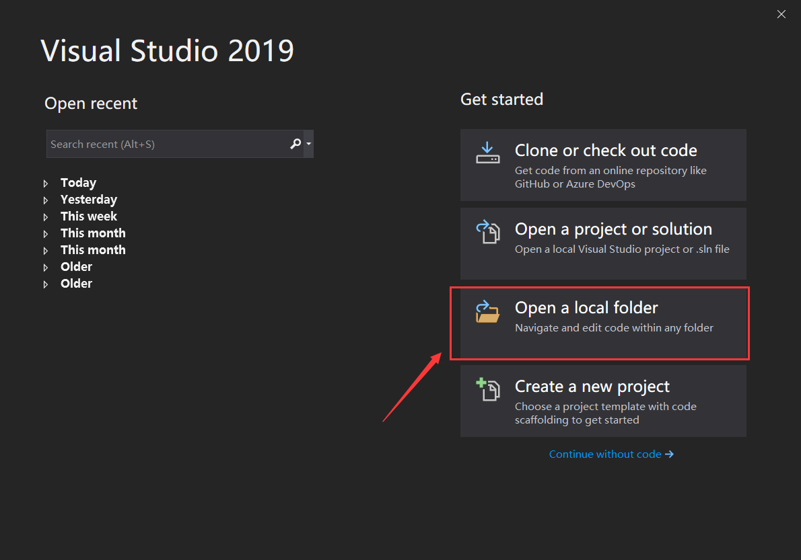
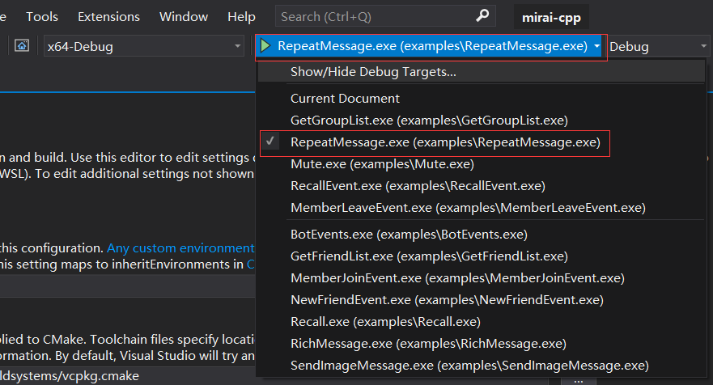

# mirai-cpp

## 项目简介

[mirai](https://github.com/mamoe/mirai) 是全开源 QQ 机器人 / QQ 协议支持库。

本项目为 mirai-http-api 的 C++ 封装，方便使用 C++ 开发 mirai-http-api 插件

## 项目依赖

> 本项目所有依赖都为 Header-Only 库，已经内置到本项目的 third-party 文件夹中。

1. [**cpp-httplib**](https://github.com/yhirose/cpp-httplib) A C++ header-only HTTP/HTTPS server and client library.

2. [**nlohmann/json**](https://github.com/nlohmann/json) 解析 JSON 数据。

3. [**ThreadPool**](https://github.com/cyanray/CURLWrapper) 线程池库，用于异步处理消息。

## 项目文档

项目文档: [使用说明](doc/使用说明.md)

更加推荐阅读完 examples 后，“按照直觉” 来使用 mirai-cpp。

| 文件名               | 说明                         |
|----------------------|------------------------------|
| RepeatMessage.cpp    | 简单的复读机器人             |
| SendImageMessage.cpp | 发送图片示例                 |
| BotEvents.cpp        | 处理有关Bot相关的事件        |
| GetFriendList.cpp    | 打印Bot的好友列表            |
| GetGroupList.cpp     | 打印Bot的群组列表            |
| MemberJoinEvent.cpp  | 处理新成员加入群的申请和事件 |
| MemberLeaveEvent.cpp | 处理成员退出群的事件         |
| MessageType.cpp      | 获取/处理各种类型的消息示例  |
| NewFriendEvent.cpp   | 处理好友申请                 |
| Recall.cpp           | 撤回消息示例                 |
| RecallEvent.cpp      | 处理其他人撤回消息的事件     |
| Mute.cpp             | 和禁言有关的操作             |
| RichMessage.cpp      | 发送 JSON、闪照等类型的消息  |

## 如何使用

### 1. 快速尝试

#### (1) 使用 Visual Studio

> 1. 完整克隆/下载本仓库。

> 2. 如图所示，使用 Visual Studio 2019 直接打开这个文件夹。

> 3. 如果一切顺利，你可以直接运行我写好的示例，或者进行修改编写自己的机器人。

#### (2) 使用 Visual Studio Code

> 1. 完整克隆/下载本仓库。

> 2. 使用 VS Code 直接打开这个文件夹。

> 3. 安装 CMake Tools 扩展。

> 4. 直接开始调试

### 3. 其他使用方式

#### (1) 将程序轻松移植、部署到 Linux 上

(以下内容基于 “快速尝试”，请先完成“快速尝试”。)

上面的内容介绍了如何在 Windows 上开发使用 mirai-cpp 的程序，下面来介绍如何将你的程序移植到 Linux 平台，以便将程序部署到 Linux 服务器上。

为了易于讲解与操作，以下内容在 **WSL** (**W**indows **S**ubsystem for **L**inux) 上进行。这里不对如何安装 WSL 进行说明，关于如何安装 WSL 还请自行查阅资料。

打开在 “快速尝试” 中用到的项目。按照如图所示步骤，创建一个针对 WSL 平台的配置。因为我的 WSL 安装了 GCC 编译器，所以这里选择 **WSL-GCC-Releas**。

如果一切顺利，等待 CMake 缓存生成成功后，即可编译出 Linux 平台的可执行文件。

#### (2) 使用 CMake-GUI 编译

未完待续……

## 代码风格

本项目的代码使用的是我自己喜欢的代码风格，如果你有更好的建议（比如修改为 Google-Style），欢迎提出 issues 或 pull request。
